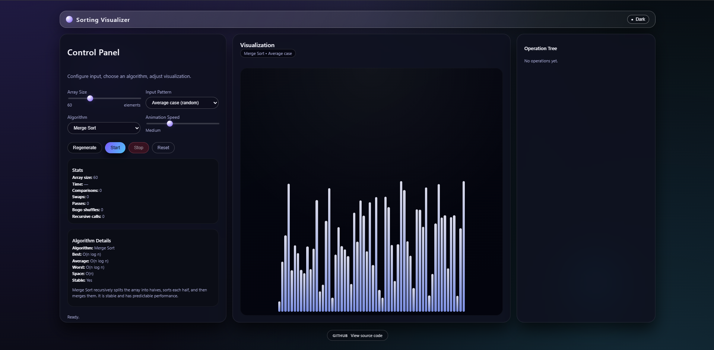

```md
# 📊 Sorting-Visualizer

A modern, fully interactive **Sorting Algorithm Visualizer** built using **HTML**, **CSS**, and **JavaScript**.  
It provides real-time animations, an operation tree, algorithm explanations, code previews, and a sleek UI with both **Dark** and **Light** themes.

Perfect for **learning, teaching, or showcasing algorithms**.

---

## 🚀 Live Demo

🔗 **https://vd2mi.github.io/Sorting-Visualizer/**  
(Automatically rebuilds whenever you push to `main`.)

---

## ✨ Features

### 🎨 Modern Interface
- Clean glassmorphic design  
- Smooth animations  
- Fully responsive  
- Dark / Light mode toggle  

### 🔄 Real-Time Visualizations
- Step-by-step sorting  
- Adjustable animation speed  
- Array size up to **200**  
- Input patterns:
  - Best case (sorted)
  - Average case (random)
  - Worst case (reversed)

### ⚙️ Algorithms Included

#### 🧮 Comparison-based
- Merge Sort  
- Quick Sort  
- Heap Sort  
- Timsort  
- Shell Sort  
- Insertion Sort  
- Selection Sort  
- Bubble Sort  
- Cocktail Sort  

#### 🔢 Non-comparison-based
- Counting Sort  
- Radix Sort  
- Bucket Sort  
- Pigeonhole Sort  
- Flash Sort  

#### 🃏 Special
- Bogo Sort (real — extremely slow)

---

## 🌳 Operation Tree Panel

A dedicated panel visualizing each algorithm's internal steps:

- Splits & merges (Merge Sort)  
- Pivots & partitions (Quick Sort)  
- Heapify steps (Heap Sort)  
- Gaps & passes (Shell Sort)  
- Buckets / ranges (Bucket, Counting, Radix, etc.)

---

## 💻 Algorithm Code Viewer

- View code in **Python**, **JavaScript**, **C++**, **Java**  
- Syntax highlighting (PrismJS)  
- Expand / collapse  
- One-click **Copy** button  

---

## 📈 Live Statistics

Tracks for every run:

- Comparisons  
- Swaps / moves  
- Recursive calls  
- Passes  
- Execution time  
- Bogo shuffles  

---

## 🛠️ Tech Stack

- HTML5  
- CSS3  
- Vanilla JavaScript  
- PrismJS (syntax highlighting)

No frameworks — everything custom-built.

---

## 📦 Run Locally

```bash
git clone https://github.com/vd2mi/Sorting-Visualizer.git
cd Sorting-Visualizer
```

Then open:

```txt
index.html
```

in your browser.

---

## 🌐 Deploy to GitHub Pages (Free)

1. Go to **Settings → Pages**
2. Set:
   - **Source:** Deploy from branch  
   - **Branch:** `main`  
   - **Folder:** `/ (root)`  
3. Click **Save**

Your live link will appear in under a minute.

---

## 📸 Screenshot

```md

```

Make sure `DEMO.png` exists in the repo root.

---

## 🤝 Contributions

Pull requests are welcome.  
This project is built for learning and helping others understand sorting algorithms in a visual, intuitive way.

---

## 📄 License

MIT License — free to use, modify, and distribute.
```
